【page 1】

> Figure 1. DiFF - a diffusion-generated facial forgery dataset encompassing over half a million images. The dataset contains manipulated images created by thirteen state-of-the-art methods under four distinct conditions. The dataset will be released at https://github. com/xaCheng1996/DiFF .

## Abstract

　Detecting diffusion-generated images has recently grown into an emerging research area. Existing diffusionbased datasets predominantly focus on general image generation. However, facial forgeries, which pose a more severe social risk, have remained less explored thus far. To address this gap, this paper introduces DiFF, a comprehensive dataset dedicated to face-focused diffusion-generated images. DiFF comprises over 500,000 images that are

## Diffusion Facial Forgery Detection

　Harry Cheng Shandong University

　Yangyang Guo National University of Singapore

　xaCheng1996@gmail.com

　guoyang.eric@gmail.com

　Tianyi Wang Nanyang Technological University

　Liqiang Nie Harbin Institute of Technology (Shenzhen)

　terry.ai.wang@gmail.com

　nieliqiang@gmail.com

　Mohan Kankanhalli National University of Singapore

　mohan@comp.nus.edu.sg

　synthesized using thirteen distinct generation methods under four conditions. In particular, this dataset leverages 30,000 carefully collected textual and visual prompts, ensuring the synthesis of images with both high fidelity and semantic consistency. We conduct extensive experiments on the DiFF dataset via a human test and several representative forgery detection methods. The results demonstrate that the binary detection accuracy of both human observers and automated detectors often falls below 30%, shedding light on the challenges in detecting diffusion-generated fa-


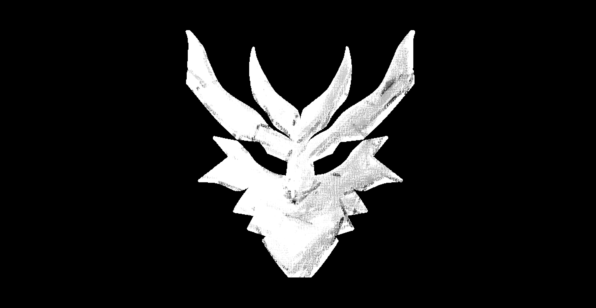


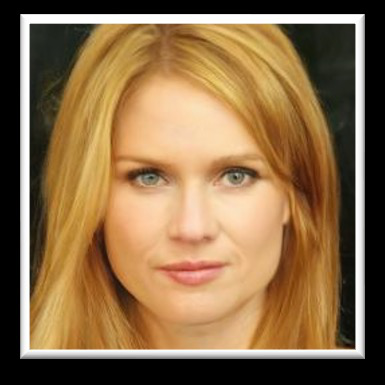


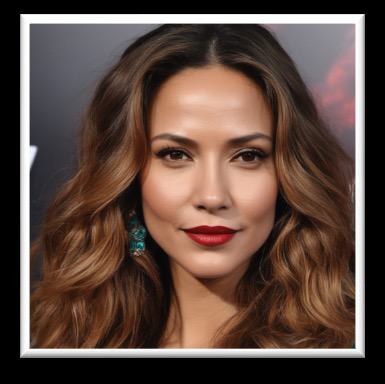


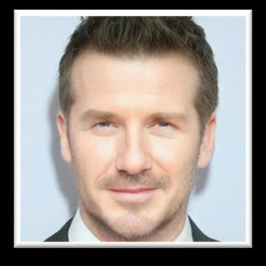

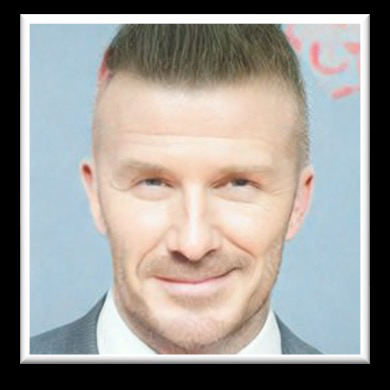

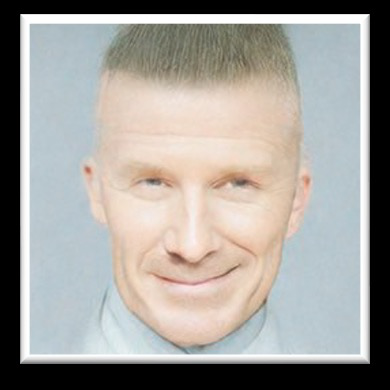

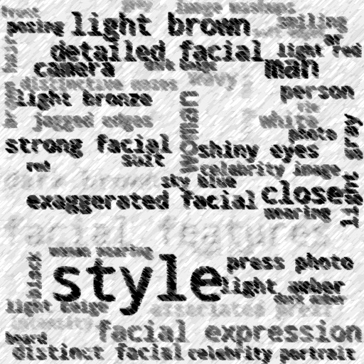


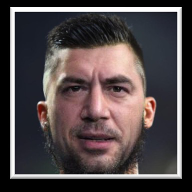


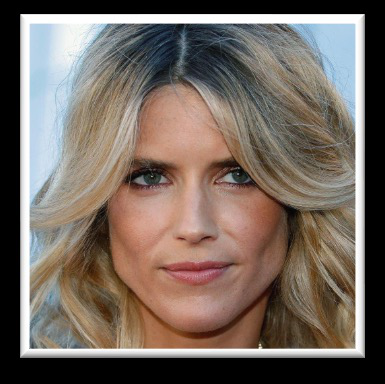


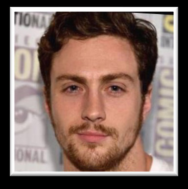

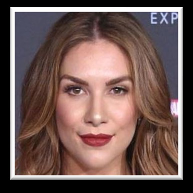


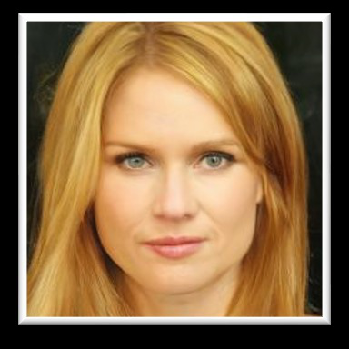


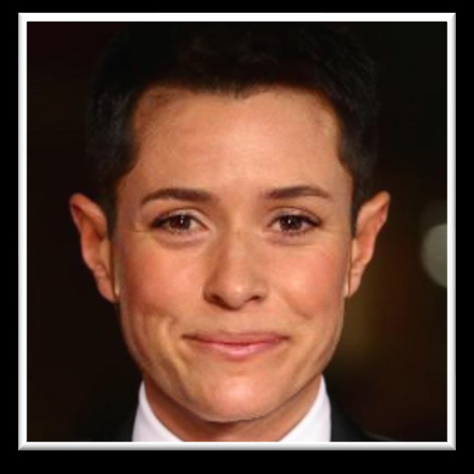


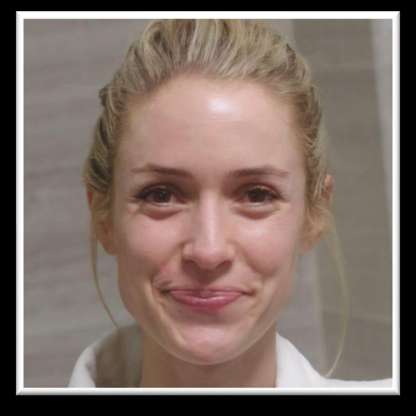


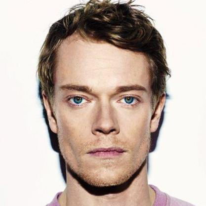

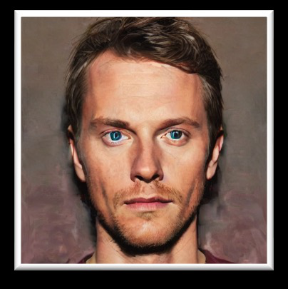


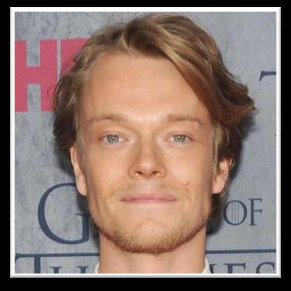

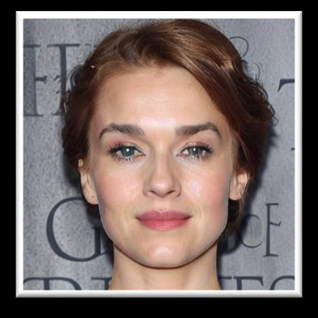


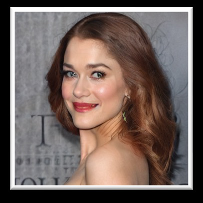

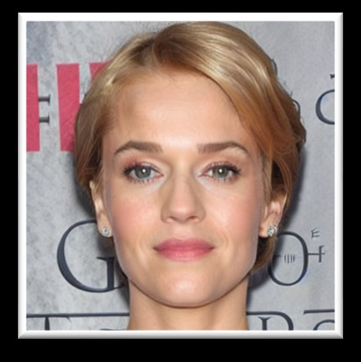

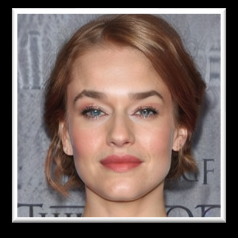

【page 2】

　cial forgeries. Furthermore, we propose an edge graph regularization approach to effectively enhance the generalization capability of existing detectors.

### 1. Introduction

　Conditional Diffusion Models (CDMs) have achieved impressive results in the field of image generation [ 3 , 48 , 50 , 55 ]. Utilizing simple inputs, such as natural language prompts, CDMs can generate images with a high degree of semantic consistency [ 15 , 25 , 73 ]. However, the precise control over the generation process offered by CDMs has also raised concerns regarding security and privacy. For instance, malicious attackers can mass-produce counterfeit images of any victim at a minimal cost, thus engendering negative social impacts. To address this problem, recent efforts have been made to collect datasets containing diffusion-generated images, wherein distribution differences [ 63 ] or amplitude variations [ 9 ] offer important cues for detection. Nevertheless, as shown in Table 1 , these datasets often encounter deficiencies when applied to detect facial forgeries, which pose more significant threats than generic fake artifacts. Specifically, most large-scale diffusion-based datasets prioritize generic images [ 9 , 26 , 46 , 53 , 57 , 63 ], like bedrooms and kitchens [ 70 ]. Although some facial-related datasets have been introduced [ 5 , 39 ], they all yet suffer from their small scale ( e.g ., only 1.5K facial images in [ 39 ]). Moreover, these facial images are typically collected under restricted conditions with a narrow range of prompts, lacking comprehensive annotations as well. As a result, training a detector with generalizability on these datasets remains less viable. This paper fills the gap by introducing the Diffusion Facial Forgery dataset, dubbed DiFF. There are three notable merits that make our dataset distinguished from existing ones. i) To the best of our knowledge, our DiFF is the first comprehensive dataset that exclusively focuses on diffusion-generated facial forgery. It contains more than 500,000 facial forgery images, a scale that significantly surpasses previous facial datasets (as shown in Table 1 ). ii) DiFF is curated using a rich variety of diffusion methods and prompts. Specifically, it encompasses thirteen state-ofthe-art diffusion techniques across four different conditions, including Text-to-Image, Image-to-Image, Face Swapping, and Face Editing. These methods are applied to generate high-quality images using over 20,000 carefully collected textual and 10,000 visual prompts, derived from 1,070 selected identities. iii) It is worth noting that each forged image in DiFF is meticulously annotated with the forgery method employed and the corresponding prompt. Using the DiFF dataset, we conducted both an in-depth human study and extensive experiments with several deepfake and diffusion detectors [ 43 , 49 , 58 , 63 ]. The results

　highlight that existing detectors exhibit limited reliability in detecting diffusion-synthesized facial forgeries. For instance, the Xception model [ 49 ], originally designed for deepfake detection, achieves an AUC of only 60% on DiFF (versus 99% on conventional deepfake datasets). To overcome this issue, we propose a novel regularization approach that leverages the edge graph of images to discern highlevel facial features, thereby enhancing the generalizability of models. Our approach can be seamlessly integrated into existing detectors, achieving an average of 10% AUC improvements when applied to four popular detectors. The contributions of this paper are three-fold: • We construct a diffusion-based facial forgery dataset with more than half a million images. To the best of our knowledge, this is the first large-scale dataset that focuses on high-quality diffusion-synthesized faces 1 . • We conduct extensive experiments on this dataset and build comprehensive benchmarks for diffusion-generated face forgery detection. • We devise a novel approach based on edge graphs to identify the manipulated faces. Our approach can be seamlessly integrated into existing detection models to enhance their detection ability.

### 2. Related Work

　2.1. Image Generation with Diffusion Models

　Following the paradigm of introducing and then removing small perturbations from original images, diffusion models demonstrate the capability to generate high-quality images from white noise [ 55 ]. Early methods require no supervision signals and often perform unconditionally. For instance, Ho et al . [ 19 ] proposed a reverse learning process by estimating the noise in the image at each step. Subsequently, researchers have explored several optimization directions, including backbone architectures [ 4 , 12 , 50 ], sampling strategies [ 34 , 40 , 68 ], and adaptation for downstream tasks [ 1 , 29 , 72 ]. For example, Sinha et al . [ 54 ] proposed mapping latent representations to images using a diffusion decoding model. Song et al . [ 56 ] employed a nonMarkovian forward process to construct denoising diffusion implicit models, resulting in a faster sampling procedure. In contrast to the above unconditional approaches, recent diffusion models have shifted their focus toward conditional image synthesis [ 7 , 23 , 47 , 51 , 69 , 71 ]. These conditions rely on various source signals, including class labels, textual prompts, and visual information, which generally describe specific image attributes. For instance, Cascaded Diffusion Models [ 20 ] initially generate low-resolution images from class labels and then employ subsequent models to increase resolutions. Furthermore, to achieve more detailed control, Text-to-Image Synthesis, which combines

　1 The dataset will be released upon the acceptance of this paper.


【page 3】

| Dataset | Venue | Type | #Synthetic Images | #Diffusion Methods | T2I | I2I | FS | FE | Real Images | Prompts | Source Labels |
| --- | --- | --- | --- | --- | --- | --- | --- | --- | --- | --- | --- |
| St¨ockl et al. [57] | Arxiv’22 | General | 260K | 1 | ✓ | × | × | × | ✓ | × | Nouns of WordNet |
| De-Fake [53] | Arxiv’22 | General | 40K | 2 | ✓ | ✓ | × | × | ✓ | ✓ | Captions of the image dataset |
| Ricker et al. [46] | Arxiv’22 | General | 70K | 7 | × | × | × | × | × | × | Unconditional generation |
| TEdBench [26] | CVPR’23 | General | 0.1K | 1 | × | × | × | ✓ | ✓ | ✓ | 100 handwritten prompts for editing |
| DiffusionForensics [63] | ICCV’23 | General | 80K | 8 | ✓ | × | × | × | ✓ | × | 1 pre-defined template |
| DMDetection [9] | ICASSP’23 | General | 200K | 3 | ✓ | × | × | × | ✓ | ✓ | Captions of the image dataset |
| GenImage [77] | NeurIPS’23 | General | 1,300K | 5 | ✓ | × | × | × | ✓ | × | 1 pre-defined template |
| GFW [5] | Arxiv’22 | Facial | 15K | 3 | ✓ | × | × | × | × | × | Captions of the image dataset |
| Mundra et al. [39] | CVPRW’23 | Facial | 1.5K | 1 | ✓ | × | × | × | × | × | 10 pre-defined templates |
| DiFF (Ours) | - | Facial | 500K | 13 | ✓ | ✓ | ✓ | ✓ | ✓ | ✓ | 30K+ filtered high-quality prompts |

> Table 1. Comparison of DiFF and mainstream diffusion datasets. Existing diffusion datasets primarily focus on general arts synthesis and utilize limited conditional input. For generation conditions - T2I: Text-to-Image, I2I: Image-to-Image, FS: Face Swapping, FE: Face Editing. Pertaining to the Real Images column, Source represents that whether there is a real image collection process.

　visual concepts and natural language, has emerged as one of the most notable advancements in diffusion models. These studies, exemplified by Stable Diffusion [ 42 , 48 ], DALLE [ 45 ], and Imagen [ 52 ], align different modalities through pre-trained vision language models such as CLIP [ 44 ]. Additionally, some approaches leverage images as conditional inputs. Zhao et al . [ 74 ] utilized an energy-based function trained on both the source and target domains to generate images that preserve domain-agnostic characteristics. Lugmayr et al . [ 36 ] proposed an inpainting method that is agnostic to mask forms, altering reverse diffusion iterations by sampling unmasked regions from provided images.

　2.2. Synthetic Image Detection

　Detecting generated images has long been a popular research focus in computer vision. Earlier methods concentrate on the detection of specific types of forgeries, such as splicing [ 24 ], copy-move [ 35 ], or inpainting [ 31 ]. Thereafter, deep learning-based approaches have been applied to identify high-quality forgeries generated by GANs or diffusion models [ 60 , 61 ]. For instance, Frank et al . [ 14 ] proposed using frequency-domain features to detect forged images, as GAN models inevitably introduce artifacts during up-sampling. Guo et al . [ 16 ] presented a hierarchical finegrained model to learn both comprehensive features and the inherent hierarchical nature of different forgery attributes. Many recent studies have been dedicated to facial forgery detection [ 6 , 62 , 64 ]. Thus far, the majority of them have focused on the detection of swapped faces generated by VAE or GAN, i.e ., deepfakes [ 33 ]. For example, Masi et al . [ 37 ] introduced a two-branch network to extract optical and frequency artifacts separately. RealForensics [ 17 ] leverages visual and auditory correspondences in real videos to improve detection performance. Huang et al . [ 22 ] derived explicit and implicit embeddings using face recognition models, and the distance between these features serves as the foundation for distinguishing real from fake faces. With the rapid development of diffusion models, the risk

　Age Group

> Figure 2. Gender and age group distribution of pristine and forgery subsets. Within each subset, percentages for different ages (ranging from 20 to 60) are calculated separately for males ( blue bars) and females ( red bars).

　posed by using them to generate counterfeit faces is gradually increasing [ 28 ]. However, research on the detection of diffusion-generated faces remains relatively unexplored. Although preliminary efforts have contributed to the detection of diffusion-generated outputs [ 9 , 46 , 63 ], they often lack generalizability and do not specifically focus on the detection of facial forgery.

### 3. Dataset Construction

　In this work, our objective is to construct a high-quality dataset for diffusion-based facial forgery. The dataset is composed of three essential components: pristine images, prompts, and forged images. The pristine images constitute the real instances of our dataset. Derived from these pristine images, the prompts serve as textual descriptions or visual cues that guide the diffusion model in generating forged images. We maintain a high degree of semantic consistency between pristine and forged images via these prompts.


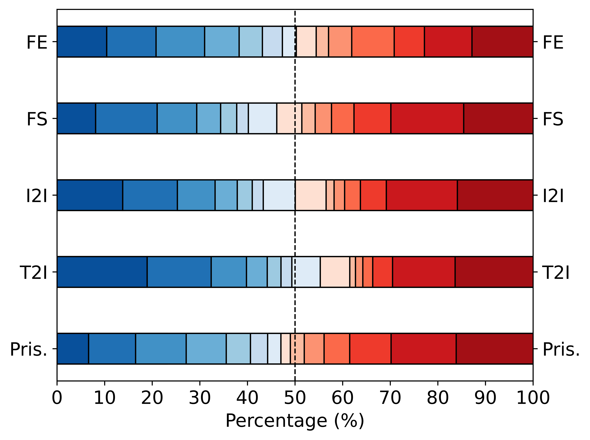

【page 4】

　2,531 Filtered Faces ! 𝐼 !

　Prompt Reverse

　Manual Modification

　Manual Rewrite

　A

　actor in... A

　A brunette actor in… A woman with … A happy man …

　with …

　man …

　% Modified prompts 𝒫 &"'

　Textual prompts 𝒫 "#$

> Figure 3. Pipeline of prompts construction and modification.

> Figure 4. Word cloud of the top 200 most frequent and content words in P t ori . Each word is sized by its frequency.

#### 3.1. Pristine Image Collection

　Our pristine images are sourced from a pool of celebrity identities. Specifically, we manually select 1,070 celebrities from established celebrity datasets such as VoxCeleb2 and CelebA [ 2 , 8 , 30 ]. Figure 2 illustrates that we have ensured a balanced gender distribution and diverse age groups among these identities. In particular, the age distribution of the selected celebrities ranges from 20 to 60 across different subsets. Subsequently, we curate approximately 20 images per identity from online videos and existing datasets, resulting in a pristine collection, denoted as I pri , which encompasses a total of 23,661 images.

#### 3.2. Prompts Construction and Modification

　Prior studies have demonstrated a positive correlation between the quality of conditional inputs and that of diffusiongenerated images [ 41 ]. As a result, diverse and precise prompts are particularly useful for generating high-quality images in CDMs. Figure 3 illustrates our dataset includes three categories of prompts: original textual prompts P t ori , modified textual prompts P t mod , and visual prompts P v . These prompts serve as conditions to guide the sampling process of diffusion models. The construction processes of

　Subset Method #Images Remarks

| Method | #Images |
| --- | --- |
| Midjourney [38] | 40,684 |
| SDXL [42] | 40,336 |
| FreeDoM T [71] | 18,207 |
| HPS [67] | 36,464 |
| SDXL Refiner [42] | 40,336 |
| LoRA [21] | 42,800 |
| DeamBooth [51] | 40,526 |
| FreeDoM I [71] | 43,593 |

> Table 2. Detailed statistics of DiFF. We employ thirteen different methods to synthesize high-quality results based on 2.5K images and their corresponding 20k textual and 10k visual prompts.

　T2I

　Facial Analysis

　I2I

　FS DiffFace [ 27 ] 55,693 First diffusion-based FS work DCFace [ 28 ] 44,721 CVPR’23

　Imagic [ 26 ] 40,508 CVPR’23 CoDiff [ 23 ] 48,672 CVPR’23 CycleDiff [ 65 ] 44,926 ICCV’23

　FE

　%

　Visual prompts 𝒫 (

　Total 537,466 -

　these prompts are detailed below. • Original textual prompts P t ori . We generate diverse and natural textual prompts via a semi-automated approach. Initially, we curate a set of 2,531 high-quality images ˆ I s ⊂I pri by selecting the clearest images of the frontal face for each identity. These images are then converted into textual descriptions using prompt inversion tools [ 10 , 38 ]. These descriptions are reviewed and rewritten by experts to remove irrelevant terms and improve clarity. Consequently, we obtain 10,084 polished prompts, and some frequent words are shown in Figure 4 . • Modified textual prompts P t mod . To broaden the diversity of prompts and enable the generation of images with specific modifications, P t mod involves alterations in key attributes of P t ori . In particular, we randomly modify the salient words that describe identities in P t ori , such as gender, hair color, or facial expression. For instance, we transform a prompt like ‘A man with an emotive face’ into ‘A woman with an emotive face.’ • Visual prompts P v . These prompts comprise comprehensive facial features - such as embeddings, sketches, landmarks, and segmentations - extracted from each image in ˆ I s . These features can be applied for diffusion models conditioned on visual cues, which is particularly useful in tasks like face editing.

#### 3.3. Facial Forgery Generation

　As illustrated in Figure 5 , we categorize existing CDMs into four main subsets [ 11 ] based on their input types: Text-toImage (T2I), which operates on textual prompts; Image-toImage (I2I) and Face Swapping (FS), both of which utilize visual inputs; and Face Editing (FE), which incorporates a combination of text and visual conditions. Figure 5a demonstrates that T2I methods receive tex-


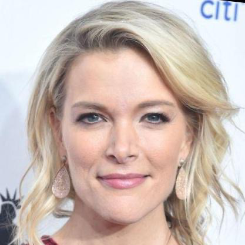


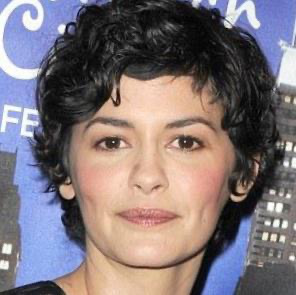

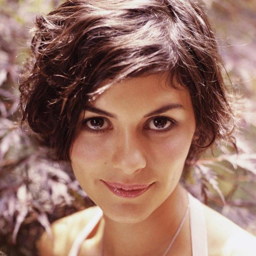


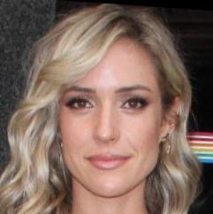

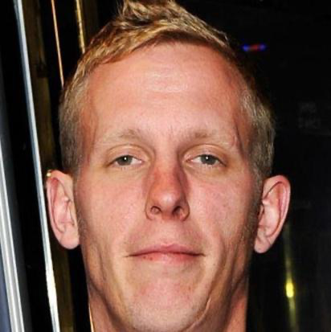

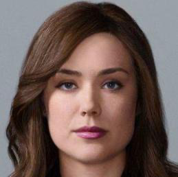


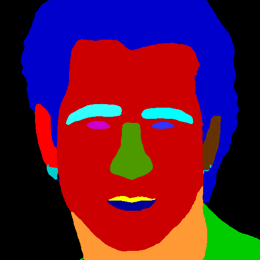

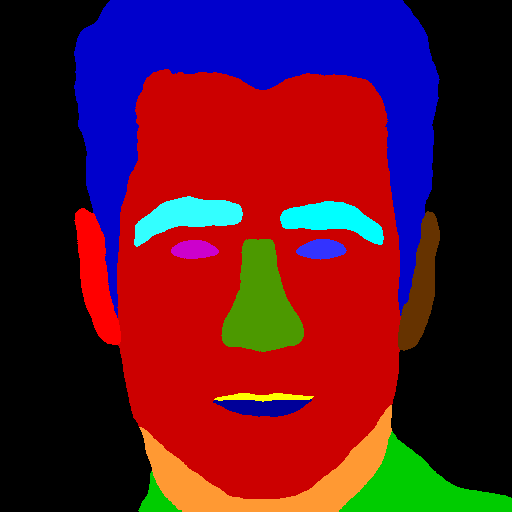

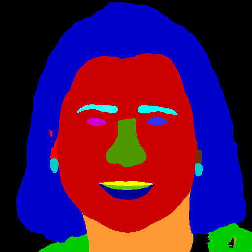


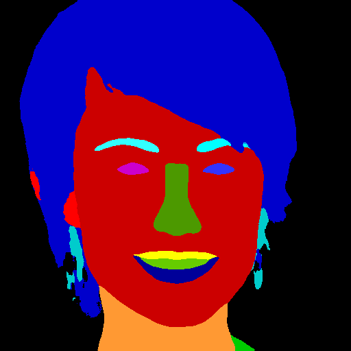


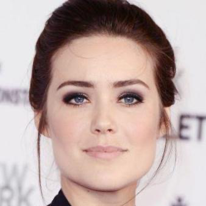


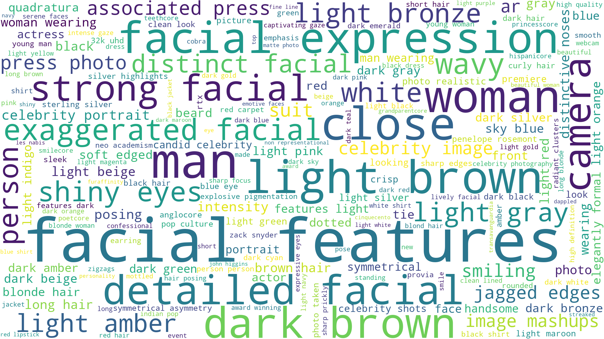

【page 5】

```math
(a) Text-to-Image (b) Image-to-Image (c) Face Swapping (d) Face Editing
```

　Prompts

　Faces

　Diffusion Model

　Generate

　Generated Faces

　tual prompts ( e.g ., ‘A man in uniform’) and synthesize images that align with the inputs’ semantic content [ 48 ]. In contrast, models processing visual input are further divided into I2I and FS categories based on their manipulation processes. Specifically, I2I, as illustrated in Figure 5b , pertains to methods that replicate a single identity. On the other hand, FS models simultaneously handle two identities and perform identity swaps as presented in Figure 5c . Lastly, Figure 5d highlights that FE models utilize multi-modal inputs to modify facial attributes, such as expressions or lip movements, while preserving other attributes. These four subsets achieve comprehensive coverage of the conditions under which existing diffusion models operate. Moreover, to ensure the diversity of generated faces, we utilize multiple cutting-edge techniques within each category. A detailed introduction to these methods is as follows: Text-to-Image. We leverage four state-of-the-art methods - Midjourney [ 38 ], Stable Diffusion XL (SDXL) [ 42 ], FreeDoM T [ 71 ], and HPS [ 67 ] - for this subset. The first two are the most influential web services for which we employ official APIs. The latter two are recently released T2I models, and we apply their pre-trained models. These models are guided by textual prompts P t ori . Image-to-Image. We apply four methods in this context: Low-Rank Adaption (LoRA) [ 21 ], DreamBooth [ 51 ], SDXL Refiner [ 42 ], and FreeDoM I . Among these approaches, the former two require fine-tuning of diffusion models to capture specific facial features. We employ I pri to train these two models. SDXL Refiner optimizes results from SDXL, whereas FreeDoM I substitutes the textual encoder in FreeDoM T with a visual encoder to reconstruct faces. Face Swapping. In this subset, we implement DiffFace [ 27 ] and DCFace [ 28 ] for the face swapping task. For each image in ˆ I s , we randomly choose ten targets from other identities to perform face swaps. In particular, to prevent information leakage, we divide the 1,070 identities into disjoint training, validation, and testing sets in a 8:1:1 ratio. Face Editing. This subset involves three approaches. In particular, the modified textual prompt set P t mod and the pristine image set ˆ I s are both used in Imagic [ 26 ] and Cycle Diffusion (CycleDiff) [ 65 ] to generate edited faces. Moreover, we use visual prompts P v to guide the training of Collaborative Diffusion (CoDiff) [ 23 ].

| Condition | Method | ACC |
| --- | --- | --- |
| Text-to-Image | Midjourney | 65.32 |
| Image-to-Image | SDXL Refiner | 71.85 |
| Face Swapping | DiffFace | 36.33 |
| Face Editing | Imagic | 68.17 |
| Text-to-Image | SDXL | 72.11 |
| Image-to-Image | LoRA | 33.33 |
| Face Swapping | DCFace | 66.67 |
| Face Editing | CoDiff | 27.78 |
| Text-to-Image | FreeDoM T | 25.47 |
| Image-to-Image | DreamBooth | 76.65 |
| Face Swapping | CycleDiff | 40.65 |
| Face Editing | HPS | 75.68 |
| Face Editing | FreeDoM I | 56.67 |

> Table 3. Human performance (%) on DiFF.

　Faces

　Diffusion

　Model

　Identity 𝛼

　Generate

　Fine-tune

　Diffusion

　Faces of 𝛼

　Model

> Figure 5. Facial forgery generation under four conditions.

　In summary, we show the statistics pertaining to the images generated by the aforementioned methods in Table 2 . As can be observed, the total number of generated images is over 500K from thirteen diffusion methods.

### 4. Dataset Evaluation

　Following the methodologies in deepfake detection [ 49 ], we cast the detection of diffusion-generated facial forgeries as a binary classification task.

　4.1. Human Evaluation

　We conducted a comprehensive human study involving 70 participants. In this study, participants are instructed to classify the authenticity of randomly selected images that are generated from varied approaches. The image selection followed a 50:50 split between pristine and fake images, with each identity appearing only once to prevent bias. Each participant is required to carefully examine 200 images, yielding 14,000 human results in total. Table 3 presents the results of this experiment across all forgery methods under four conditions. One can observe that human observers struggle to distinguish the vast majority of forgery methods, as accuracy falls below the chance level (50%). For instance, participants achieved an accuracy of merely 27.78% when identifying images generated by CoDiff. Among the four conditions, FE poses the most challenge for human observers. This result can be attributed to the fact that this subset involves modifying a single real image, which allows for a more faithful reproduction of original features, such as illumination and texture.

　4.2. Comparison with Existing Datasets

　Statistics analysis . We presented the FID and PSNR metrics in Table 4 . The results reveal notable improvements in


【page 6】

| Metric | FF++ [49] | ForgeryNet [18] | DFor [63] | GFW [5] | DiFF |
| --- | --- | --- | --- | --- | --- |
| FID ↓ | 33.87 | 36.94 | 31.79 | 39.35 | 25.75 |
| PSNR ↑ | 18.47 | 18.98 | 19.17 | 19.14 | 19.95 |

> Table 4. FID and PSNR comparison across various datasets.

| Method | FF++ [49] | GFW [5] | DiFF |
| --- | --- | --- | --- |
| Xception | 98.12 | 99.72 | 93.87 |
| F3-Net | 98.89 | 99.17 | 98.47 |
| EfficientNet | 98.51 | 97.58 | 94.34 |
| DIRE | 99.43 | 99.59 | 96.35 |

> Table 5. AUC (%) of detectors trained and tested on same datasets.

| Method | Train Set | FF++ [49] | DFor [63] | GFW [5] | DiFF | DFDC [13] | ForgeryNet [18] |
| --- | --- | --- | --- | --- | --- | --- | --- |
| Xception | FF++ [49] | - | 40.65 | 43.42 | 65.96 | 63.97 | 50.56 |
| Xception | DFor [63] | 55.21 | - | 52.30 | 75.67 | 56.35 | 38.06 |
| Xception | GFW [5] | 53.37 | 45.81 | - | 74.87 | 51.43 | 62.75 |
| Xception | DiFF | 65.33 | 55.30 | 63.50 | - | 67.10 | 65.78 |

> Table 6. AUC (%) of detectors trained on different datasets.

　DiFF, suggesting that the images in this dataset bear a closer resemblance to reality.

　Comparisons with face forgery datasets Beyond the observed benefits in terms of FID and PSNR, Table 5 indicates that the AUCs of DiFF are relatively lower, highlighting the dataset’s greater complexity. This can be attributed to the extensive diversity of conditions in DiFF, which is three times greater than that in GFW.

　Moreover, we utilized FF++ (a vanilla deepfake dataset), GFW (a diffusion-generated facial forgery dataset), DFor (a diffusion-generated general forgery dataset), and our DiFF as training datasets to compared their generalization capabilities. Additionally, we utilized two widely acknowledged deepfake datasets, DFDC [ 13 ] and ForgeryNet [ 18 ], for further evaluation.

　From Table 6 , it can be seen that the detector trained on DiFF exhibits superior generalization capabilities. It is worth noting that detectors trained on other datasets achieve high accuracy when tested on DiFF. This may be attributed to DiFF’s inclusion of a diverse array of image types, effectively encompassing a wide spectrum of distributions.

#### 4.3. Detection Results of Existing Methods

　For this experiment, we split our DiFF dataset into training, validation, and testing sets with a 8:1:1 ratio. We tuned the hyper-parameters using the validation set, and results on the testing set are reported. Detailed numerical values for all figures are available in the supplemental material.

| Test Subset | Method | Train Set | Source Set | T2I | I2I | FS | FE |
| --- | --- | --- | --- | --- | --- | --- | --- |
| Deepfake Test Subset | Xception† [49] | FF++ [49] | 98.12 | 62.43 | 56.83 | 85.97 | 58.64 |
| Deepfake Test Subset | F3-Net† [43] | FF++ [49] | 98.89 | 66.87 | 67.64 | 81.01 | 60.60 |
| Deepfake Test Subset | EffciientNet† [58] | FF++ [49] | 98.51 | 74.12 | 57.27 | 82.11 | 57.20 |
| Deepfake Test Subset | DIRE‡ [63] | FF++ [49] | 99.43 | 44.22 | 64.64 | 84.98 | 57.72 |
| General Diffusion Test Subset | Xception† [49] | DFor | 99.98 | 20.52 | 30.92 | 69.42 | 37.89 |
| General Diffusion Test Subset | F3-Net† [43] | DFor | 99.99 | 43.88 | 60.58 | 52.39 | 47.06 |
| General Diffusion Test Subset | EffciientNet† [58] | DFor | 98.99 | 27.23 | 44.79 | 61.25 | 30.86 |
| General Diffusion Test Subset | DIRE‡ [63] | DFor | 98.80 | 36.37 | 34.83 | 36.28 | 39.92 |

> Table 7. AUC (%) of detectors. Each detector is trained on the deepfake dataset (FF++) and the diffusion-generated general forgery dataset (DFor) separately, and tested on subsets of the DiFF dataset. † : models for deepfake detection. ‡ : models for general diffusion detection.

　4.3.1 Cross-domain Detection

　Following previous studies on forgery detection [ 63 ], we adopted a cross-domain testing methodology to explore the challenges of facial forgery detection. This involves evaluating models that have performed well in related detection domains. Initially, these models are trained on benchmark datasets tailored to their respective tasks. We then evaluated their performance on DiFF. Three widely recognized deepfake detection models are utilized: Xception [ 49 ], F 3 - Net [ 43 ], and EfficientNet [ 58 ]. Moreover, we included DIRE [ 63 ], a state-of-the-art detector for general diffusiongenerated images, for this experiment. These models are trained on the FF++ dataset [ 49 ] and the DiffusionForensics dataset [ 63 ], respectively. Table 7 displays the Area under the ROC Curve (AUC) scores for these detectors. From this table, we can observe that these detectors encounter a significant drop in performance upon domain transfer. For example, DIRE exhibits an AUC drop of over 60%. This sharp degradation indicates the inherent challenge of detecting diffusion-based facial forgeries and suggests the considerable obstacles that pre-trained detectors face when applied to this new task.

　4.3.2 In-domain Detection

　Given that existing deepfake and general diffusion detectors cannot be seamlessly transferred to detect diffusion facial forgery, one may question the efficacy of re-training these detectors on DiFF. Therefore, we conducted experiments with an in-domain setting. Similar to previous evaluation protocols for the detection of deepfake and general diffusion forgery [ 32 , 63 ], detectors are trained on a single subset of DiFF, followed by the test on the remaining ones. Detection on re-training detectors. We presented the retraining results in Figure 6 . It can be observed that detectors


【page 7】

　Tested on T2I Tested on I2I Tested on FS Tested on FE

　Xception F 3 -Net EfficientNet DIRE (a) Trained on T2I

　Xception F 3 -Net EfficientNet DIRE (c) Trained on FS

> Figure 6. AUC (%) comparison among re-trained detectors.

　perform satisfactorily when trained and tested on the same subset. However, when transferred to different subsets, they exhibit varying degrees of performance degradation. The most significant drop reaches up to 80% ( e.g ., Xception, trained on FS and tested on FE). This significant drop highlights the challenge in developing a facial forgery detector that effectively generalizes across various conditions. It is worth noting that detectors trained on the T2I and I2I subsets, which both rely on classical diffusion processes, demonstrate a higher degree of similarity in performance. This is evident from mutual benefits observed in the first two subplots of Figure 6 . FE-trained detectors show better generalization capability than those trained in other subsets. This may be attributed to the FE subset’s utilization of multi-modal inputs, leading to a wider diversity of images, thereby enabling detectors trained on the FE subset to capture more diffusion artifacts. Detection on linear probing detectors. We introduced the strategy of linear probing as an alternative to the full re-training approach. Specifically, we used Xception pretrained on the FF++ dataset as described in Section 4.3.1 and optimized its last linear layer to align with the data distribution of DiFF. The results are presented in Figure 7 . One can observe that models using the linear probing strategy significantly outperform the re-training ones in detecting FS and FE forgeries. For instance, when trained on the I2I subset, the linear probing model for detecting FS and FE forgeries surpass the re-training models by 50% and 40%, respectively. A critical reason is that the pre-training dataset, i.e ., FF++, encompasses a large number of GANbased manipulated faces. This diversity enables linear probing models to effectively identify face-swapping and faceediting images. However, it is worth noting that linear probing models show inferior results when trained and tested on the same subset ( e.g ., both trained and tested on T2I), suggesting insufficient capacity of this strategy. Detection on fine-tuning detectors. In contrast to the lin-

```math
Re-training Linear Probing Fine-tuning
```

　Xception F 3 -Net EfficientNet DIRE (b) Trained on I2I

　T2I I2I FS FE (a) Trained on T2I

　T2I I2I FS FE (b) Trained on I2I

　Xception F 3 -Net EfficientNet DIRE (d) Trained on FE

　T2I I2I FS FE (c) Trained on FS

　T2I I2I FS FE (d) Trained on FE

> Figure 7. AUC (%) of Xception with different training strategies.

| Method | Train Subset | None | GN | GB | MB | JPEG |
| --- | --- | --- | --- | --- | --- | --- |
| Xception | T2I | 59.52 | 47.65 | 15.02 | 56.59 | 58.69 |
| F3-Net | T2I | 76.08 | 48.04 | 74.67 | 71.68 | 74.61 |
| EfficientNet | T2I | 67.69 | 40.09 | 53.62 | 65.35 | 54.98 |
| DIRE | T2I | 66.28 | 34.07 | 32.78 | 41.36 | 40.99 |
| Xception | I2I | 66.74 | 19.70 | 54.09 | 58.07 | 63.66 |
| F3-Net | I2I | 68.39 | 21.38 | 58.77 | 66.17 | 63.61 |
| EfficientNet | I2I | 57.78 | 27.76 | 54.75 | 52.39 | 51.01 |
| DIRE | I2I | 67.40 | 35.69 | 26.63 | 65.19 | 65.67 |
| Xception | FS | 39.44 | 35.40 | 34.82 | 38.58 | 37.73 |
| F3-Net | FS | 46.64 | 44.44 | 37.91 | 46.39 | 42.10 |
| EfficientNet | FS | 37.29 | 36.74 | 23.82 | 36.12 | 35.13 |
| DIRE | FS | 46.03 | 25.36 | 34.00 | 28.15 | 32.11 |
| Xception | FE | 82.69 | 39.69 | 24.15 | 79.35 | 81.19 |
| F3-Net | FE | 78.84 | 50.17 | 25.51 | 38.76 | 70.31 |
| EfficientNet | FE | 77.33 | 51.95 | 39.65 | 71.10 | 71.14 |
| DIRE | FE | 64.89 | 35.42 | 55.59 | 60.08 | 53.08 |

> Table 8. AUC (%) comparison among re-trained detectors with different post-processing methods. Each row represents the average performance when tested on all four DiFF subsets. None : no processing methods. GN : Gaussian Noise; GB : Gaussian Blur; MB : Median Blur; JPEG : JPEG Compression.

　ear probing strategy, which updates only the final layer, the fine-tuning approach optimizes all the model parameters. For this experiment, we reduce the learning rate of models for stable training. Figure 7 illustrates that fine-tuning models demonstrate superior performance compared to the re-training ones. For example, fine-tuning models achieve higher AUCs in the detection of FS and FE forgeries, regardless of the training subset used. This can also be attributed to the pre-training on FF++. However, compared to linear probing models, the generalizability of the finetuning approaches is somewhat limited. This may be due to a significant discrepancy between diffusion-generated facial forgeries and GAN-based manipulated faces. Such a domain gap could lead to catastrophic forgetting in the model. Detection with post-processing methods. We evaluated re-training detectors under various image quality settings


【page 8】

　by applying several post-processing techniques. Following previous settings [ 76 ], we processed real and forged images with Gaussian Noise (GN), Gaussian Blur (GB), Median Blur (MB), and JPEG Compression (JPEG). Table 8 reveals that, in most scenarios, applying post-processing methods leads to a degradation in the detection performance. For instance, the use of GB results in a 40% reduction in the AUC for Xception when trained on the T2I subset.

### 5. Edge Graph Regularization

　5.1. Motivation

　Compared to real human faces captured by cameras, generated faces are more likely to evoke anomalies such as frequency transitions or brightness fluctuations [ 46 ]. In particular, we extract the edge graphs of pristine and forged images with the Sobel operator [ 59 , 60 ]. Figure 8 illustrates that the edge graphs of the pristine images are significantly different from those of the synthesized images. Specifically, edge graphs extracted from pristine images often capture intricate facial details, such as fine wrinkles around the cheeks and the eyes. In contrast, the synthesized images lack these subtle contours and are of considerable contrast. One naive approach to exploit the discriminative capability of edge graphs for facial forgery detection is to train a binary classifier directly. However, our experiments indicate that this approach is less favorable, as demonstrated in Section 5.3 . Instead, we propose an Edge Graph Regularization (EGR) method, which enhances the discriminative ability of detectors by incorporating edge graphs into the processing of original images.

　5.2. Methodology

　Vanilla deepfake and general diffusion detecors entails fitting the distribution of a specific dataset to discriminate between pristine and forged images. Let S = { ( I i , y i ) } n i =1 be the dataset and Θ be the continuous parameter space, where I i is the i -th image with respect to the target label y i . For each parameter set θ ∈ Θ , the empirical risk during training is formulated as follows:

　n X

　ˆ R S ( θ ) := 1

　n

　where ℓ ( · ) is the loss function such that,

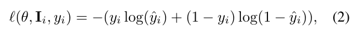

　where ˆ y i is the score from the predictive function f θ : I i → [0 , 1] associated with θ . However, such training approaches are highly susceptible to overfitting [ 32 , 49 , 66 ]. Therefore, many endeavors have been made to improve generalizability using additional features [ 22 , 75 ]. In light of these studies, our method employs a novel regularization

| Backbone | +EGR | Train Subset | T2I | I2I | FS | FE |
| --- | --- | --- | --- | --- | --- | --- |
| Xception | × | T2I | 93.32 | 86.85 | 34.65 | 23.28 |
| Xception | ✓ | T2I | 95.57 | 89.48 | 43.74 | 55.50 |
| F3-Net | × | T2I | 99.60 | 88.50 | 45.07 | 71.06 |
| F3-Net | ✓ | T2I | 99.64 | 93.30 | 56.34 | 79.89 |
| EfficientNet | × | T2I | 99.89 | 89.72 | 21.49 | 49.63 |
| EfficientNet | ✓ | T2I | 99.93 | 97.89 | 40.86 | 52.36 |
| DIRE | × | T2I | 95.04 | 84.07 | 35.15 | 50.86 |
| DIRE | ✓ | T2I | 99.79 | 99.76 | 43.59 | 66.41 |
| Xception | × | I2I | 87.82 | 98.92 | 36.82 | 33.39 |
| Xception | ✓ | I2I | 99.00 | 99.94 | 49.73 | 33.81 |
| F3-Net | × | I2I | 87.23 | 99.50 | 40.62 | 46.19 |
| F3-Net | ✓ | I2I | 96.85 | 99.70 | 48.69 | 47.66 |
| EfficientNet | × | I2I | 84.39 | 99.80 | 19.47 | 27.46 |
| EfficientNet | ✓ | I2I | 99.77 | 99.99 | 56.69 | 61.04 |
| DIRE | × | I2I | 86.20 | 99.88 | 41.51 | 42.01 |
| DIRE | ✓ | I2I | 97.65 | 99.99 | 51.84 | 58.68 |
| Xception | × | FS | 23.17 | 24.47 | 99.95 | 10.17 |
| Xception | ✓ | FS | 67.41 | 55.92 | 99.98 | 46.01 |
| F3-Net | × | FS | 35.43 | 30.39 | 99.98 | 20.79 |
| F3-Net | ✓ | FS | 63.51 | 63.75 | 99.99 | 31.14 |
| EfficientNet | × | FS | 16.88 | 22.17 | 99.87 | 10.21 |
| EfficientNet | ✓ | FS | 64.16 | 67.92 | 99.99 | 22.01 |
| DIRE | × | FS | 16.08 | 36.27 | 99.09 | 32.68 |
| DIRE | ✓ | FS | 66.21 | 70.91 | 99.99 | 35.45 |
| Xception | × | FE | 80.84 | 79.12 | 70.81 | 99.95 |
| Xception | ✓ | FE | 94.15 | 84.04 | 73.09 | 99.99 |
| F3-Net | × | FE | 82.32 | 76.92 | 56.27 | 99.60 |
| F3-Net | ✓ | FE | 97.91 | 93.46 | 79.33 | 99.61 |
| EfficientNet | × | FE | 80.41 | 63.06 | 66.62 | 99.24 |
| EfficientNet | ✓ | FE | 96.50 | 89.97 | 73.28 | 99.99 |
| DIRE | × | FE | 56.70 | 59.22 | 43.78 | 99.87 |
| DIRE | ✓ | FE | 81.40 | 76.40 | 74.23 | 99.99 |

> Table 9. Model performance (%) with and without our edge graph regularization (EGR) method. Each row represents the performance of the model trained on a specific subset and tested on all four DiFF subsets. Better results are highlighted in bold.

　method, which incorporates edge graphs as a regularization term into the original empirical risk. This strategy encourages the model to simultaneously focus on the features of both the original and edge graphs, thereby mitigating overfitting. Specifically, we refine the empirical risk as follows:

　n X

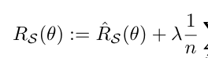

　i =1 ( ℓ ( θ, E i , y i )) , (3)

　n

　where E i represents the edge graph of the i -th image, and λ ∈ [0 , 1] is a regularization parameter that calibrates the influence of edge graphs.

　i =1 ℓ ( θ, I i , y i ) , (1)

　5.3. Evaluation of EGR

　Main results. In Table 9 , we compared the performance of baseline detectors and our method. Each model is trained on one forgery condition and subsequently evaluated on all four conditions. From the table, one can observe that our EGR method significantly improves the generalizability of the baseline detectors. It is worth noting that even when a model is trained and tested in the same subset, EGR still contributes to performance enhancement, such as improv-


【page 9】

> Figure 8. Edge graphs of pristine images (first row) and non-cherry-picked forged facial images (last two rows).

| Method | Setting | T2I | I2I | FS | FE |
| --- | --- | --- | --- | --- | --- |
| Xception | with regu. | 95.57 | 89.48 | 43.74 | 55.50 |
| Xception | w/o regu. | 95.54 (-0.03) | 88.91 (-0.57) | 43.31 (-0.43) | 53.21 (-2.29) |
| F3-Net | with regu. | 99.64 | 93.30 | 56.34 | 79.89 |
| F3-Net | w/o regu. | 97.83 (-1.81) | 93.02 (-0.28) | 51.50 (-4.84) | 64.80 (-15.09) |
| EfficientNet | with regu. | 99.93 | 97.89 | 40.86 | 52.36 |
| EfficientNet | w/o regu. | 98.97 (-0.96) | 96.34 (-1.55) | 26.09 (-14.77) | 49.82 (-2.54) |
| DIRE | with regu. | 99.79 | 99.76 | 43.59 | 66.41 |
| DIRE | w/o regu. | 99.78 (-0.01) | 99.70 (-0.06) | 32.36 (-11.23) | 61.61 (-4.80) |

> Table 10. AUC (%) comparison of detectors with the removal of the regularization approaches. All models are trained on T2I.

　ing Xception with 2.2% AUC on T2I. Ablation study. To evaluate the impact of the proposed EGR method, we conducted experiments using edge graphs as the only input. In other words, we removed the ˆ R S ( θ ) in Equation ( 3 ), and optimized the model with E i . The results of these tests are presented in Table 10 . We can observe a significant decline in detector performance upon removing the regularization approach. For instance, in the FE subset, the AUC of F 3 -Net drops by 15%. The dominant reason is that relying solely on edge graphs overlooks vital information in original images, such as color and texture. On the other hand, incorporating the EGR enables models to capture a more broad context, leading to better performance.

### 6. Discussion and Conclusion

　We propose DiFF, a large-scale, high-quality diffusiongenerated facial forgery dataset, to address limitations of existing datasets that underestimate the risks associated with facial forgeries. Our dataset comprises over 500,000 facial images. Each image maintains high semantic consistency with its original counterpart, guided by diverse prompts. We conduct extensive experiments using DiFF and establish a facial forgery detection benchmark. Moreover, we design an edge graph regularization method that effectively improves detector performance. In the future, we plan to further expand DiFF in terms of methods and conditions and explore new tasks based on DiFF, such as the traceability and retrieval of diffusion-generated images. Potential Ethical Considerations. The pristine faces in our

　dataset are sourced from publicly accessible celebrity online videos. We have rigorously reviewed all prompts to ensure that they do not describe specific biometric details. Each generated image has been carefully examined to align with societal values. We will try our best to control the acquisition procedure of DiFF to mitigate potential misuse.


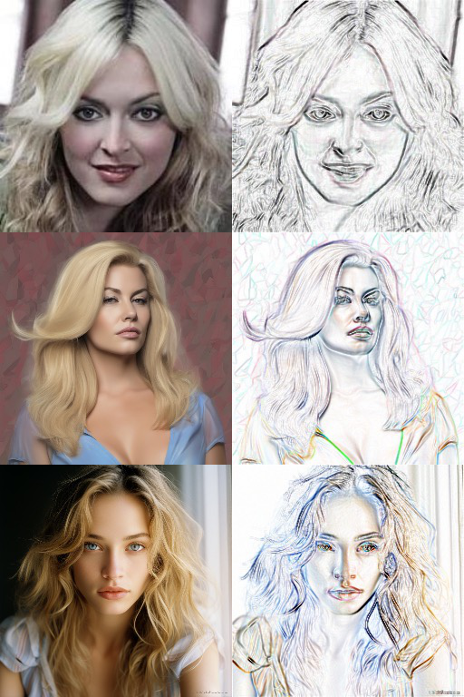


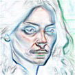


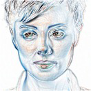


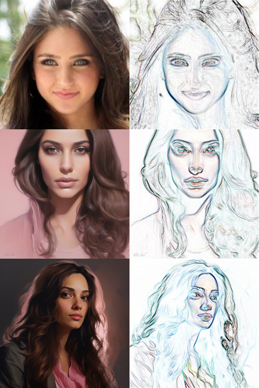


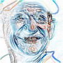


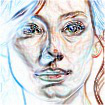


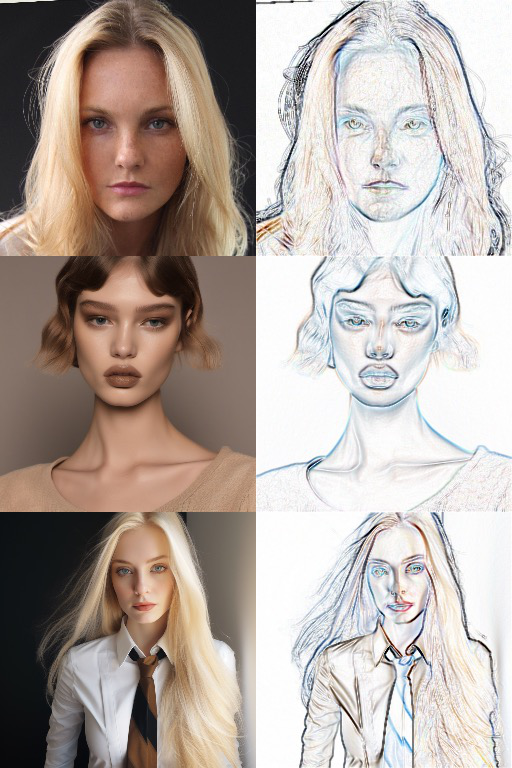

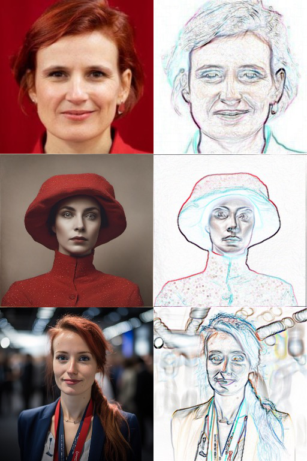

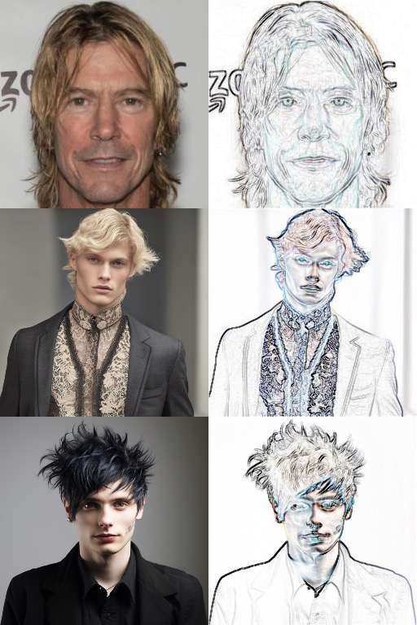


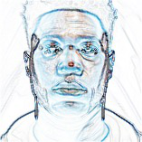

【page 10】

## References

　[1] Omri Avrahami, Dani Lischinski, and Ohad Fried. Blended diffusion for text-driven editing of natural images. In CVPR , pages 18187-18197, 2022. 2 [2] Yeqi Bai, Tao Ma, Lipo Wang, and Zhenjie Zhang. Speech fusion to face: Bridging the gap between human’s vocal characteristics and facial imaging. In ACM MM , pages 2042- 2050, 2022. 4 [3] Fan Bao, Chongxuan Li, Jun Zhu, and Bo Zhang. Analyticdpm: an analytic estimate of the optimal reverse variance in diffusion probabilistic models. In ICLR , pages 1-12, 2022. 2 [4] Sam Bond-Taylor, Peter Hessey, Hiroshi Sasaki, Toby P. Breckon, and Chris G. Willcocks. Unleashing transformers: Parallel token prediction with discrete absorbing diffusion for fast high-resolution image generation from vectorquantized codes. In ECCV , pages 170-188, 2022. 2 [5] Ali Borji. Generated faces in the wild: Quantitative comparison of stable diffusion, midjourney and DALL-E 2. CoRR , pages 1-4, 2022. 2 , 3 , 6 [6] Liang Chen, Yong Zhang, Yibing Song, Lingqiao Liu, and Jue Wang. Self-supervised learning of adversarial example: Towards good generalizations for deepfake detection. In CVPR , pages 18689-18698, 2022. 3 [7] Wenhu Chen, Hexiang Hu, Chitwan Saharia, and William W. Cohen. Re-imagen: Retrieval-augmented text-to-image generator. In ICLR , pages 1-9, 2023. 2 [8] Joon Son Chung, Arsha Nagrani, and Andrew Zisserman. Voxceleb2: Deep speaker recognition. In Interspeech , pages 1086-1090, 2018. 4 [9] Riccardo Corvi, Davide Cozzolino, Giada Zingarini, Giovanni Poggi, Koki Nagano, and Luisa Verdoliva. On the detection of synthetic images generated by diffusion models. In ICASSP , pages 1-5, 2023. 2 , 3 [10] Florinel-Alin Croitoru, Vlad Hondru, Radu Tudor Ionescu, and Mubarak Shah. Reverse stable diffusion: What prompt was used to generate this image? CoRR , pages 1-13, 2023. 4 [11] Florinel-Alin Croitoru, Vlad Hondru, Radu Tudor Ionescu, and Mubarak Shah. Diffusion models in vision: A survey. IEEE TPAMI , 45(9):10850-10869, 2023. 4 [12] Prafulla Dhariwal and Alexander Quinn Nichol. Diffusion models beat gans on image synthesis. In NeurIPS , pages 8780-8794, 2021. 2 [13] Brian Dolhansky, Joanna Bitton, Ben Pflaum, Jikuo Lu, Russ Howes, Menglin Wang, and Cristian Canton-Ferrer. The deepfake detection challenge dataset. CoRR , pages 1-13, 2020. 6 [14] Joel Frank, Thorsten Eisenhofer, Lea Sch¨onherr, Asja Fischer, Dorothea Kolossa, and Thorsten Holz. Leveraging frequency analysis for deep fake image recognition. In ICML , pages 3247-3258, 2020. 3 [15] Shuyang Gu, Dong Chen, Jianmin Bao, Fang Wen, Bo Zhang, Dongdong Chen, Lu Yuan, and Baining Guo. Vector quantized diffusion model for text-to-image synthesis. In CVPR , pages 10686-10696, 2022. 2

　[16] Xiao Guo, Xiaohong Liu, Zhiyuan Ren, Steven Grosz, Iacopo Masi, and Xiaoming Liu. Hierarchical fine-grained image forgery detection and localization. In CVPR , pages 3155-3165, 2023. 3 [17] Alexandros Haliassos, Rodrigo Mira, Stavros Petridis, and Maja Pantic. Leveraging real talking faces via selfsupervision for robust forgery detection. In CVPR , pages 14930-14942, 2022. 3 [18] Yinan He, Bei Gan, Siyu Chen, Yichun Zhou, Guojun Yin, Luchuan Song, Lu Sheng, Jing Shao, and Ziwei Liu. Forgerynet: A versatile benchmark for comprehensive forgery analysis. In CVPR , pages 4360-4369, 2021. 6 [19] Jonathan Ho, Ajay Jain, and Pieter Abbeel. Denoising diffusion probabilistic models. In NeurIPS , pages 1-12, 2020. 2 [20] Jonathan Ho, Chitwan Saharia, William Chan, David J. Fleet, Mohammad Norouzi, and Tim Salimans. Cascaded diffusion models for high fidelity image generation. JMLR , 23:47:1- 47:33, 2022. 2 [21] Edward J. Hu, Yelong Shen, Phillip Wallis, Zeyuan AllenZhu, Yuanzhi Li, Shean Wang, Lu Wang, and Weizhu Chen. Lora: Low-rank adaptation of large language models. In ICLR , pages 1-13, 2022. 4 , 5 [22] Baojin Huang, Zhongyuan Wang, Jifan Yang, Jiaxin Ai, Qin Zou, Qian Wang, and Dengpan Ye. Implicit identity driven deepfake face swapping detection. In CVPR , pages 4490- 4499, 2023. 3 , 8 [23] Ziqi Huang, Kelvin C. K. Chan, Yuming Jiang, and Ziwei Liu. Collaborative diffusion for multi-modal face generation and editing. In CVPR , pages 6080-6090, 2023. 2 , 4 , 5 [24] Minyoung Huh, Andrew Liu, Andrew Owens, and Alexei A. Efros. Fighting fake news: Image splice detection via learned self-consistency. In ECCV , pages 106-124, 2018. 3 [25] Yuming Jiang, Shuai Yang, Haonan Qiu, Wayne Wu, Chen Change Loy, and Ziwei Liu. Text2human: text-driven controllable human image generation. ACM Transactions on Graphics , 41(4):162:1-162:11, 2022. 2 [26] Bahjat Kawar, Shiran Zada, Oran Lang, Omer Tov, Huiwen Chang, Tali Dekel, Inbar Mosseri, and Michal Irani. Imagic: Text-based real image editing with diffusion models. In CVPR , pages 6007-6017, 2023. 2 , 3 , 4 , 5 [27] Kihong Kim, Yunho Kim, Seokju Cho, Junyoung Seo, Jisu Nam, Kychul Lee, Seungryong Kim, and KwangHee Lee. Diffface: Diffusion-based face swapping with facial guidance. CoRR , pages 1-11, 2022. 4 , 5 [28] Minchul Kim, Feng Liu, Anil K. Jain, and Xiaoming Liu. Dcface: Synthetic face generation with dual condition diffusion model. In CVPR , pages 12715-12725, 2023. 3 , 4 , 5 [29] Max W. Y. Lam, Jun Wang, Dan Su, and Dong Yu. BDDM: bilateral denoising diffusion models for fast and high-quality speech synthesis. In ICLR , pages 1-12, 2022. 2 [30] Cheng-Han Lee, Ziwei Liu, Lingyun Wu, and Ping Luo. Maskgan: Towards diverse and interactive facial image manipulation. In CVPR , pages 5548-5557, 2020. 4


【page 11】

　[31] Haodong Li, Weiqi Luo, and Jiwu Huang. Localization of diffusion-based inpainting in digital images. IEEE TIFS , 12 (12):3050-3064, 2017. 3 [32] Lingzhi Li, Jianmin Bao, Ting Zhang, Hao Yang, Dong Chen, Fang Wen, and Baining Guo. Face x-ray for more general face forgery detection. In CVPR , pages 5000-5009, 2020. 6 , 8 [33] Yixuan Li, Chao Ma, Yichao Yan, Wenhan Zhu, and Xiaokang Yang. 3d-aware face swapping. In CVPR , pages 12705-12714, 2023. 3 [34] Luping Liu, Yi Ren, Zhijie Lin, and Zhou Zhao. Pseudo numerical methods for diffusion models on manifolds. In ICLR , pages 1-11, 2022. 2 [35] Yaqi Liu, Chao Xia, Xiaobin Zhu, and Shengwei Xu. Twostage copy-move forgery detection with self deep matching and proposal superglue. IEEE TIP , 31:541-555, 2022. 3 [36] Andreas Lugmayr, Martin Danelljan, Andr´es Romero, Fisher Yu, Radu Timofte, and Luc Van Gool. Repaint: Inpainting using denoising diffusion probabilistic models. In CVPR , pages 11451-11461, 2022. 3 [37] Iacopo Masi, Aditya Killekar, Royston Marian Mascarenhas, Shenoy Pratik Gurudatt, and Wael AbdAlmageed. Twobranch recurrent network for isolating deepfakes in videos. In ECCV , pages 667-684, 2020. 3 [38] Midjourney. https://www.midjourney.com, 2022. 4 , 5 [39] Shivansh Mundra, Gonzalo J. Aniano Porcile, Smit Marvaniya, James R. Verbus, and Hany Farid. Exposing gangenerated profile photos from compact embeddings. In CVPRW , pages 884-892, 2023. 2 , 3 [40] Alexander Quinn Nichol and Prafulla Dhariwal. Improved denoising diffusion probabilistic models. In ICML , pages 8162-8171, 2021. 2 [41] Nikita Pavlichenko and Dmitry Ustalov. Best prompts for text-to-image models and how to find them. In SIGIR , pages 2067-2071, 2023. 4 [42] Dustin Podell, Zion English, Kyle Lacey, Andreas Blattmann, Tim Dockhorn, Jonas M¨uller, Joe Penna, and Robin Rombach. SDXL: improving latent diffusion models for high-resolution image synthesis. CoRR , pages 1-21, 2023. 3 , 4 , 5 [43] Yuyang Qian, Guojun Yin, Lu Sheng, Zixuan Chen, and Jing Shao. Thinking in frequency: Face forgery detection by mining frequency-aware clues. In ECCV , pages 86-103, 2020. 2 , 6 [44] Alec Radford, Jong Wook Kim, Chris Hallacy, Aditya Ramesh, Gabriel Goh, Sandhini Agarwal, Girish Sastry, Amanda Askell, Pamela Mishkin, Jack Clark, Gretchen Krueger, and Ilya Sutskever. Learning transferable visual models from natural language supervision. In ICML , pages 8748-8763, 2021. 3 [45] Aditya Ramesh, Mikhail Pavlov, Gabriel Goh, Scott Gray, Chelsea Voss, Alec Radford, Mark Chen, and Ilya Sutskever. Zero-shot text-to-image generation. In ICML , pages 8821- 8831, 2021. 3 [46] Jonas Ricker, Simon Damm, Thorsten Holz, and Asja Fischer. Towards the detection of diffusion model deepfakes. CoRR , pages 1-11, 2022. 2 , 3 , 8

　[47] Robin Rombach, Andreas Blattmann, Dominik Lorenz, Patrick Esser, and Bj¨orn Ommer. High-resolution image synthesis with latent diffusion models. In CVPR , pages 10674- 10685, 2022. 2 [48] Robin Rombach, Andreas Blattmann, Dominik Lorenz, Patrick Esser, and Bj¨orn Ommer. High-resolution image synthesis with latent diffusion models. In CVPR , pages 10674- 10685. IEEE, 2022. 2 , 3 , 5 [49] Andreas R¨ossler, Davide Cozzolino, Luisa Verdoliva, Christian Riess, Justus Thies, and Matthias Nießner. Faceforensics++: Learning to detect manipulated facial images. In ICCV , pages 1-11, 2019. 2 , 5 , 6 , 8 [50] Ludan Ruan, Yiyang Ma, Huan Yang, Huiguo He, Bei Liu, Jianlong Fu, Nicholas Jing Yuan, Qin Jin, and Baining Guo. Mm-diffusion: Learning multi-modal diffusion models for joint audio and video generation. In CVPR , pages 10219- 10228, 2023. 2 [51] Nataniel Ruiz, Yuanzhen Li, Varun Jampani, Yael Pritch, Michael Rubinstein, and Kfir Aberman. Dreambooth: Fine tuning text-to-image diffusion models for subject-driven generation. In CVPR , pages 22500-22510, 2023. 2 , 4 , 5 [52] Chitwan Saharia, William Chan, Saurabh Saxena, Lala Li, Jay Whang, Emily L. Denton, Seyed Kamyar Seyed Ghasemipour, Raphael Gontijo Lopes, Burcu Karagol Ayan, Tim Salimans, Jonathan Ho, David J. Fleet, and Mohammad Norouzi. Photorealistic text-to-image diffusion models with deep language understanding. In NeurIPS , pages 1-15, 2022. 3 [53] Zeyang Sha, Zheng Li, Ning Yu, and Yang Zhang. DEFAKE: detection and attribution of fake images generated by text-to-image diffusion models. CoRR , pages 1-14, 2022. 2 , 3 [54] Abhishek Sinha, Jiaming Song, Chenlin Meng, and Stefano Ermon. D2C: diffusion-decoding models for few-shot conditional generation. In NeurIPS , pages 12533-12548, 2021. 2 [55] Jascha Sohl-Dickstein, Eric A. Weiss, Niru Maheswaranathan, and Surya Ganguli. Deep unsupervised learning using nonequilibrium thermodynamics. In ICML , pages 2256-2265, 2015. 2 [56] Jiaming Song, Chenlin Meng, and Stefano Ermon. Denoising diffusion implicit models. In ICLR , pages 1-12, 2021. 2 [57] Andreas St¨ockl. Evaluating a synthetic image dataset generated with stable diffusion. CoRR , pages 1-13, 2022. 2 , 3 [58] Mingxing Tan and Quoc V. Le. Efficientnet: Rethinking model scaling for convolutional neural networks. In ICML , pages 6105-6114, 2019. 2 , 6 [59] O Rebecca Vincent, Olusegun Folorunso, et al. A descriptive algorithm for sobel image edge detection. In InSITE , pages 97-107, 2009. 8 [60] Jingtian Wang, Xiaolong Li, and Yao Zhao. A novel face forgery detection method based on edge details and reusednetwork. In ICCSNT , pages 100-104, 2021. 3 , 8 [61] Sheng-Yu Wang, Oliver Wang, Richard Zhang, Andrew Owens, and Alexei A. Efros. Cnn-generated images are sur-


【page 12】

　prisingly easy to spot... for now. In CVPR , pages 8692-8701, 2020. 3 [62] Yuan Wang, Kun Yu, Chen Chen, Xiyuan Hu, and Silong Peng. Dynamic graph learning with content-guided spatialfrequency relation reasoning for deepfake detection. In CVPR , pages 7278-7287, 2023. 3 [63] Zhendong Wang, Jianmin Bao, Wengang Zhou, Weilun Wang, Hezhen Hu, Hong Chen, and Houqiang Li. DIRE for diffusion-generated image detection. In ICCV , pages 22445- 22455, 2023. 2 , 3 , 6 [64] Zhendong Wang, Jianmin Bao, Wengang Zhou, Weilun Wang, and Houqiang Li. Altfreezing for more general video face forgery detection. In CVPR , pages 4129-4138, 2023. 3 [65] Chen Henry Wu and Fernando De la Torre. A latent space of stochastic diffusion models for zero-shot image editing and guidance. In ICCV , pages 7378-7387, 2023. 4 , 5 [66] Xi Wu, Zhen Xie, YuTao Gao, and Yu Xiao. Sstnet: Detecting manipulated faces through spatial, steganalysis and temporal features. In ICASSP , pages 2952-2956, 2020. 8 [67] Xiaoshi Wu, Keqiang Sun, Feng Zhu, Rui Zhao, and Hongsheng Li. Better aligning text-to-image models with human preference. In ICCV , pages 2096-2105, 2023. 4 , 5 [68] Zhisheng Xiao, Karsten Kreis, and Arash Vahdat. Tackling the generative learning trilemma with denoising diffusion gans. In ICLR , pages 1-15, 2022. 2 [69] Zhengyuan Yang, Jianfeng Wang, Zhe Gan, Linjie Li, Kevin Lin, Chenfei Wu, Nan Duan, Zicheng Liu, Ce Liu, Michael Zeng, and Lijuan Wang. Reco: Region-controlled text-toimage generation. In CVPR , pages 14246-14255, 2023. 2 [70] Fisher Yu, Yinda Zhang, Shuran Song, Ari Seff, and Jianxiong Xiao. LSUN: construction of a large-scale image dataset using deep learning with humans in the loop. CoRR , pages 1-9, 2015. 2 [71] Jiwen Yu, Yinhuai Wang, Chen Zhao, Bernard Ghanem, and Jian Zhang. Freedom: Training-free energy-guided conditional diffusion model. ICCV , pages 23174-23184, 2023. 2 , 4 , 5 [72] Guanhua Zhang, Jiabao Ji, Yang Zhang, Mo Yu, Tommi S. Jaakkola, and Shiyu Chang. Towards coherent image inpainting using denoising diffusion implicit models. In ICML , pages 41164-41193, 2023. 2 [73] Qinsheng Zhang and Yongxin Chen. Fast sampling of diffusion models with exponential integrator. In ICLR , pages 1-12, 2023. 2 [74] Min Zhao, Fan Bao, Chongxuan Li, and Jun Zhu. EGSDE: unpaired image-to-image translation via energyguided stochastic differential equations. In NeurIPS , pages 1-14, 2022. 3 [75] Yipin Zhou and Ser-Nam Lim. Joint audio-visual deepfake detection. In ICCV , pages 14800-14809, 2021. 8 [76] Jiren Zhu, Russell Kaplan, Justin Johnson, and Li Fei-Fei. Hidden: Hiding data with deep networks. In ECCV , pages 682-697, 2018. 8 [77] Mingjian Zhu, Hanting Chen, Qiangyu Yan, Xudong Huang, Guanyu Lin, Wei Li, Zhijun Tu, Hailin Hu, Jie Hu, and Yunhe Wang. Genimage: A million-scale benchmark for detecting ai-generated image. CoRR , pages 1-11, 2023. 3
